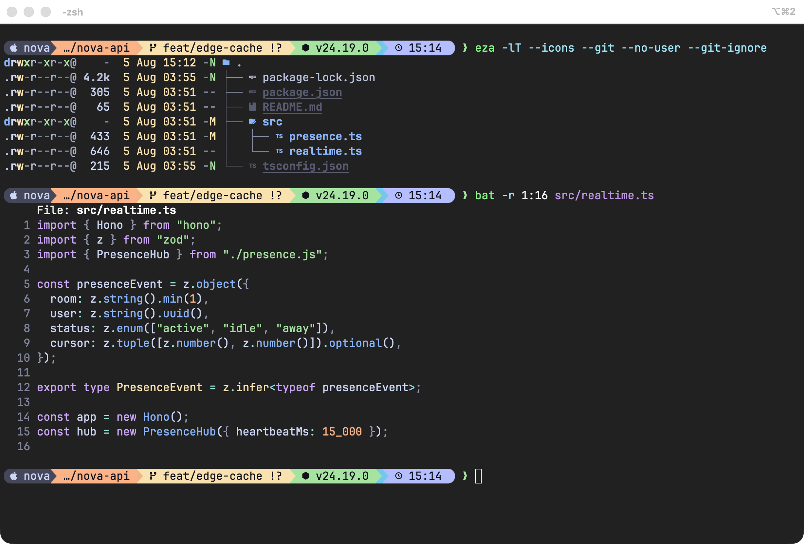
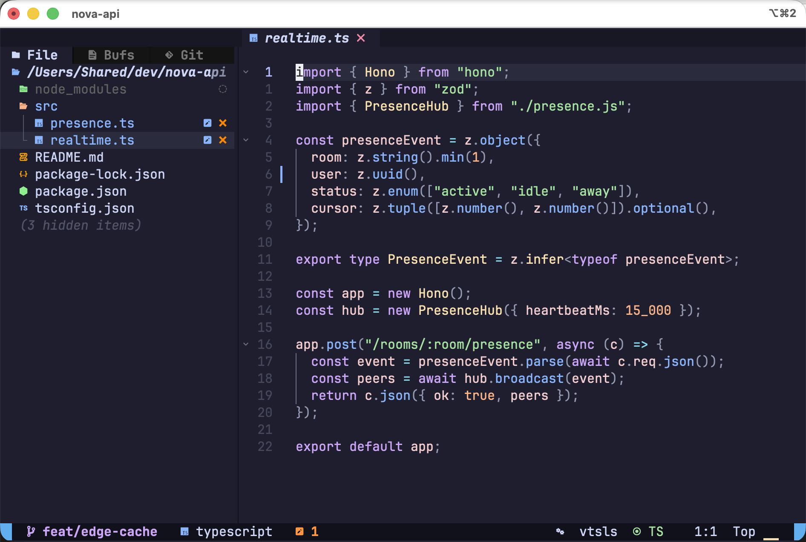

# dotfiles

Development environment for macOS and Linux (Debian/Ubuntu) - starship + catppuccin mocha, modern CLI tools, one-command install with two modes.



*starship with the catppuccin powerline preset: git branch and dirty state, node version resolved from `.nvmrc` by mise, eza tree listing with icons and git status, bat syntax highlighting. Dracula+ in iTerm2.*



*AstroNvim v6: neo-tree with git status, TypeScript LSP (vtsls) on the statusline, gitsigns change markers, catppuccin - plugin versions pinned by a committed `lazy-lock.json`.*

## Install

On a clean machine, one command does everything (Command Line Tools / apt deps, Homebrew, clone, full setup):

```bash
curl -fsSL https://raw.githubusercontent.com/ikwach/dotfiles/master/bootstrap.sh | bash -s -- personal
```

Minimal Ubuntu images may not ship curl; wget works the same:

```bash
wget -qO- https://raw.githubusercontent.com/ikwach/dotfiles/master/bootstrap.sh | bash -s -- corporate
```

Or clone first and run the installer directly:

```bash
git clone https://github.com/ikwach/dotfiles.git ~/workspace/dotfiles
cd ~/workspace/dotfiles

./install.sh personal    # everything: core + AI, cloud, media tools
./install.sh corporate   # restricted: core CLI tools only
```

Optional flags (work with both entry points):

| Flag | Effect |
|---|---|
| `--with-macos-defaults` | apply the system settings in `macos.sh` (keyboard repeat, Finder, screenshots folder, tap to click) |
| `--with-mac-keys` | Linux only: install [Toshy](https://github.com/RedBearAK/toshy) for mac-style keyboard shortcuts |

Everything is idempotent - rerun any time. Existing configs are backed up to `~/.dotfiles-backup-<timestamp>` before being replaced with symlinks. Personal mode also installs node (lts) and go via mise, and neovim plugins and language servers are pre-installed at exact lockfile versions, so the first `nvim` launch is instant. On macOS an iTerm2 dynamic profile named `dotfiles` appears automatically with Dracula+ colors and the nerd font baked in - select it once as your default profile.

## Modes

| | corporate | personal |
|---|:---:|:---:|
| Shell: zsh + antidote + starship (catppuccin) | ✅ | ✅ |
| CLI: bat, eza, ripgrep, fd, fzf, zoxide, atuin, dust, btop, jq, yq, tealdeer | ✅ | ✅ |
| Git: delta (catppuccin), lazygit, gh | ✅ | ✅ |
| Dev: neovim, mise, tmux, iTerm2, JetBrains Mono Nerd Font | ✅ | ✅ |
| AI: Claude Code, Claude desktop | - | ✅ |
| Cloud: gcloud, cloud-sql-proxy, firebase, vercel, supabase | - | ✅ |
| Media: ffmpeg, yt-dlp, pandoc, rclone | - | ✅ |
| 1Password CLI | - | ✅ |

Corporate mode also prompts for your **work** git email, and nothing personal is baked into the repo - identity, secrets, and machine-specific config all live in local files (see below).

### Linux

Packages come from [Homebrew on Linux](https://docs.brew.sh/Homebrew-on-Linux) on both OSes, so there is one manifest with identical tool versions and no `batcat`/`fdfind` renames. apt is only used to bootstrap Homebrew's build dependencies. Casks (iTerm2, the GUI apps in personal mode) are macOS-only and get skipped; JetBrains Mono Nerd Font is installed from the nerd-fonts release into `~/.local/share/fonts` instead. For the stock GNOME Terminal, set that font in your profile and use [catppuccin/gnome-terminal](https://github.com/catppuccin/gnome-terminal) for the colors. The `install` CI workflow runs corporate mode on both Ubuntu and macOS on every PR.

## What's where

```
bootstrap.sh         # greenfield entry point (CLT/apt deps, brew, clone, install)
Brewfile.core        # cross-platform packages for both modes
Brewfile.macos       # macOS-only: iTerm2, nerd font cask, mas
Brewfile.personal    # extras for personal mode
install.sh           # installer (brew, symlinks, git identity, secrets, theme caches)
macos.sh             # opt-in macOS system defaults (--with-macos-defaults)
iterm2/              # dynamic profile (Dracula+ colors + nerd font, auto-loaded)
zsh/                 # .zshrc + antidote plugin list
starship/            # prompt config (catppuccin mocha powerline)
git/                 # .gitconfig (identity excluded) + global ignore
tmux/                # tmux config with catppuccin v2
nvim/                # AstroNvim v6 (language packs, catppuccin, pinned lockfile)
bat/  lazygit/  tealdeer/   # per-tool configs
themes/              # vendored catppuccin themes (bat, delta, btop, eza, iterm)
bin/                 # gifenc (ffmpeg gif encoder), super-sync (rsync watch)
```

## Local files (never committed)

| File | Purpose |
|---|---|
| `~/.gitconfig.local` | git name/email - created by installer |
| `~/.secrets.env` | API keys, `chmod 600`, sourced by `.zshrc`; prefer `op read` for values |
| `~/.zshrc.local` | machine-specific shell config |

## Daily drivers

```bash
z <dir>       # jump to a directory you've visited (zoxide)
Ctrl+R        # fuzzy history search (atuin)
Ctrl+T        # fuzzy file picker (fzf)
ll / la / lt  # eza listings (long / all / tree)
lg            # lazygit
osup          # update everything (brew, plus App Store/OS on macOS, apt on Linux)
mise use -g node@lts  # runtime versions (replaces nvm/pyenv/rbenv)
```

## Theming

The CLI toolchain is [catppuccin](https://github.com/catppuccin) **mocha**: starship (official catppuccin-powerline preset), bat, fzf, delta, lazygit, eza, tmux, tealdeer. To change flavor: edit `palette =` in `starship/starship.toml` and swap the vendored files in `themes/` from the corresponding catppuccin repo.

The terminal itself runs **Dracula+**, and btop uses its bundled **dracula** theme to match - both pair surprisingly well with the catppuccin prompt, since starship colors are truecolor and independent of the terminal scheme. iTerm2 needs a one-time manual setup (its settings aren't file-based): Settings > Profiles > Colors > Color Presets > Import > `themes/iterm/dracula-plus.itermcolors` (or `catppuccin-mocha.itermcolors` for an all-catppuccin look), and Settings > Profiles > Text > Font > **JetBrainsMono Nerd Font** (needed for the prompt icons).

## Updating

```bash
cd ~/workspace/dotfiles && git pull && ./install.sh <mode>
```

## Notes

- Neovim is AstroNvim v6 with community packs for TypeScript, Rust, Go, Python, JSON, YAML and Markdown, catppuccin, and `lazy-lock.json` committed so plugin versions are identical on every machine. First launch finishes installing language servers automatically; run `:Lazy update` on your own schedule and commit the refreshed lockfile.
- `mise` reads `.nvmrc` / `.tool-versions` / `.python-version` automatically per project.
- tmux plugins install on first launch, or `prefix + I` (prefix is `Ctrl+a`).
